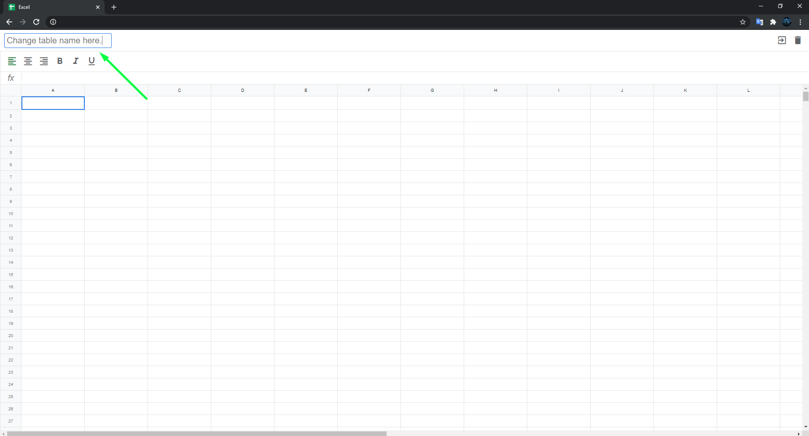

# This app is a parody of google-excel.

### You can see the finished result by clicking on the [link](https://goldikrom.000webhostapp.com/).

This application uses webpack. I added my webpack config to the project. You can learn more [here](https://github.com/Ikrom-Murodov/Webpack-4).

# What technologies does this application use ?

1) JavaScript with Typescript.
2) Sass.
3) Pug.

Application dependencies.

All packages that are dependencies for this application are mine.

1) [router-for-dom](https://github.com/Ikrom-Murodov/router-for-dom).
2) [parody-of-redux](https://github.com/Ikrom-Murodov/parody-of-redux).
3) [observer-pattern-js](https://github.com/Ikrom-Murodov/observer-pattern-js).
4) [helper-for-dom](https://github.com/Ikrom-Murodov/helper-for-dom).
5) [add-event-for-dom-elements](https://github.com/Ikrom-Murodov/add-event-for-dom-elements).

# How to use this application ?

1 Go to the main page. [excel-table](https://github.com/Ikrom-Murodov/Webpack-4) .

2 Create a new table.

3 You can update the table name.

4 You can resize row.

5 You can resize column.

6 You can add text to cell.

7 You can add styles for the cell.

8 You can add styles to multiple cells at once.

9 You can use math operations.

10 You can go to the home page.

11 You can navigate from the main page to the table page you created.

12 You can delete the table page and go to the main page.

